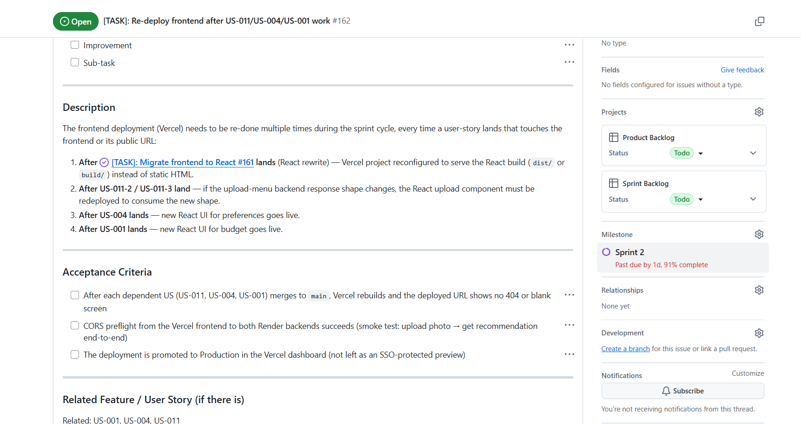

# Week 4 Report – Orderly

## Project information

- **Name:** Orderly – Food Recommendation App
- **Short description:** A web app that helps users choose dishes from restaurant menus based on their preferences, allergens, and budget. Users upload a menu photo; OCR extracts the text; AI recommends the best matching dish.
- **License:** [MIT](../../LICENSE)

---

## Sprint information

- **Sprint:** Sprint 2 (MVP v2)
- **Dates:** 22 Jun 2026 – 28 Jun 2026
- **Sprint Goal:** End-to-end flow works on the live deployment. Users fill a preferences questionnaire (with mandatory allergens), upload a menu photo with a budget, OCR extracts the text, the parser structures it, and the recommender returns a dish that matches preferences, contains no allergens, and fits the budget.
- **Total Sprint size:** 55 SP

### Scope summary

| User Story | Title | SP |
|-----------|-------|----|
| US-001 | Propose dishes according to the budget | 18 |
| US-004 | Propose dishes according to preferences + allergens | 21 |
| US-011-2 | Text extraction (OCR) | 8 |
| US-011-3 | Parsing and structuring menu | 5 |
| DEPLOY-1 | Deploy + smoke test | 3 |

- [Sprint 2 milestone](https://github.com/Orderly-Team24/team-24/milestone/2)
- [Product Backlog board](https://github.com/orgs/Orderly-Team24/projects/2)
- [Sprint Backlog board](https://github.com/orgs/Orderly-Team24/projects/3)

---

## Delivered product changes

- **US-001 — Budget filtering:** `max_budget` field added to the recommendation request. Backend post-filter guarantees no dish above budget is returned, even if the LLM ignores the prompt constraint. Frontend budget input field added.
- **US-012-1 — Order history backend stub:** `POST /history/orders`, `GET /history/orders`, `GET /history/orders/check` endpoints implemented with thread-safe in-memory storage. Dish ID derived from name hash to prevent duplicates.
- **Budget filter hardening:** Negative budget and NaN price values are now rejected with HTTP 422.

---

## Links

- **Deployed product:** [https://frontend-pearl-sigma-1diis9tsn9.vercel.app](https://frontend-pearl-sigma-1diis9tsn9.vercel.app)
- **Run / access instructions:** [README.md](../../README.md)
- **SemVer release (MVP v2):** <!-- add link after v0.2.0 is released -->
- **CHANGELOG.md:** [CHANGELOG.md](../../CHANGELOG.md)
- **Roadmap:** [docs/roadmap.md](../../docs/roadmap.md)
- **Definition of Done:** [docs/definition-of-done.md](../../docs/definition-of-done.md)
- **Quality Requirements:** [docs/quality-requirements.md](../../docs/quality-requirements.md)
- **Quality Requirement Tests:** [docs/quality-requirement-tests.md](../../docs/quality-requirement-tests.md)
- **Testing strategy:** [docs/testing.md](../../docs/testing.md)
- **User Acceptance Tests:** [docs/user-acceptance-tests.md](../../docs/user-acceptance-tests.md)

---

## Customer feedback response

| Feedback point | Resulting PBI or issue | Status | Response |
|----------------|----------------------|--------|----------|
| Customer requested budget-based filtering | [US-001 #57](https://github.com/Orderly-Team24/team-24/issues/57) | Done | Max budget field added; backend post-filter enforces the constraint |
| Customer wanted to save dishes they liked | [US-012 #146](https://github.com/Orderly-Team24/team-24/issues/146) | In progress | Backend stub complete (#157); frontend button deferred to Sprint 3 |
| Customer requested preferences (cuisine, allergens) | [US-004 #64](https://github.com/Orderly-Team24/team-24/issues/64) | In progress | Backend extended; frontend modal in review |
| OCR quality was low on some menu photos | Backlog (no issue yet) | Not planned for this Sprint | Pre-processing (contrast, grayscale) deferred to Sprint 3 due to higher-priority quality and CI work |

---

## Quality model

**ISO/IEC 25010 sub-characteristics used:**

| ID | Sub-characteristic | Summary |
|----|-------------------|---------|
| QR-01 | Reliability – Fault tolerance | Returns HTTP 503 (no stub dish) when AI backend is unavailable |
| QR-02 | Performance efficiency – Time behaviour | `/display/recommendations` responds ≤ 500 ms under single-user stub load |
| QR-03 | Security – Input validation | Invalid inputs (blank name, negative budget, missing header) rejected with 422 / 400 |

See [docs/quality-requirements.md](../../docs/quality-requirements.md) for full scenario definitions.

---

## Testing status

| Module | Role | Coverage status |
|--------|------|----------------|
| `src/backend/budget_filter.py` | Budget post-filter | ≥ 30% (enforced) |
| `src/backend/order_history.py` | Order history store | ≥ 30% (enforced) |
| `src/backend/parser.py` | Menu text parser | ≥ 30% (enforced) |
| `src/upload-menu-backend/main.py` | Upload + OCR endpoint | ≥ 30% (enforced) |

- **Unit tests:** [`src/backend/tests/test_budget_filter.py`](../../src/backend/tests/test_budget_filter.py), [`src/backend/tests/test_parser.py`](../../src/backend/tests/test_parser.py), [`src/backend/tests/test_history_router.py`](../../src/backend/tests/test_history_router.py)
- **Integration tests:** [`src/backend/tests/test_budget_filter.py`](../../src/backend/tests/test_budget_filter.py), [`src/backend/tests/test_history_router.py`](../../src/backend/tests/test_history_router.py), [`src/upload-menu-backend/tests/test_upload.py`](../../src/upload-menu-backend/tests/test_upload.py)
- **Quality requirement tests:** [docs/quality-requirement-tests.md](../../docs/quality-requirement-tests.md)

### Additional QA check — Bandit (Security Static Analysis)

**Options considered:**

| Tool | Category | Reason not selected |
|------|----------|-------------------|
| `pip-audit` / `safety` | Dependency vulnerability scanning | Useful but doesn't cover application code; CVE feeds require network access in CI |
| `semgrep` | Multi-language SAST | Powerful, but requires a paid account for Python rulesets beyond the open-source set |
| `schemathesis` | OpenAPI fuzz / contract testing | No OpenAPI spec generated yet; deferred until spec is stabilised |
| `hypothesis` | Property-based testing | Complements unit tests rather than replacing a QA gate; deferred to Sprint 3 |
| **Bandit** | Python SAST — security | ✅ **Selected** — zero config, pip-installable, runs offline, covers the exact risk vectors in our stack |

**Selected check:** [Bandit](https://bandit.readthedocs.io/) — Python security static analyser

**QA objective:** Detect common security vulnerabilities in Python source code before they reach production: hardcoded credentials, unsafe `eval` / `exec`, shell-injection patterns in subprocess calls, and path-traversal risks in file-upload handlers.

**Why this risk matters for Orderly:**
Both backends handle externally-supplied data — user-uploaded image files and AI-generated text used to build HTTP responses. A path-traversal bug in the upload handler, or a shell-injection flaw in the Tesseract invocation, could expose the server. Bandit catches these patterns statically, before any deployment.

**Where it runs in CI:** `.github/workflows/backend-ci.yml` — step "Run Bandit security scan (medium + high severity)", command `bandit -r src/backend src/upload-menu-backend -ll`. Runs on every push to `main` and every pull request.

**Limitations:**
- Bandit does not replace penetration testing or a full security audit.
- False positives are possible; medium-severity findings are reviewed rather than auto-blocked.
- Frontend JavaScript is not covered — `npm audit` for the React bundle is deferred to Sprint 3.
- Dynamic/runtime vulnerabilities (e.g. SSRF via user-controlled URLs) are out of scope for static analysis.

---

## CI pipeline

- **CI pipeline:** [`.github/workflows/backend-ci.yml`](../../.github/workflows/backend-ci.yml)
- **Latest CI run on main:** <!-- add link after first CI run passes on main -->
- **Branch protection:** <!-- add screenshot in images/ after configuring branch protection rule -->

These CI gates, QRTs, coverage thresholds, and Definition of Done requirements are maintained project assets. All later Sprints must keep them passing. New PBIs must not bypass or disable these checks.

---

## UAT results summary

UAT was conducted with the customer during the Sprint Review session.

| Scenario | Result | Notes |
|----------|--------|-------|
| UAT-01 – Budget-filtered recommendation | <!-- Pass / Fail --> | <!-- notes --> |
| UAT-02 – Menu photo upload and recommendation | <!-- Pass / Fail --> | <!-- notes --> |
| UAT-03 – Save dish to order history | <!-- Pass / Fail --> | Frontend button not yet deployed; tested via API only |

Most important feedback: <!-- fill after customer session -->

Resulting PBIs: <!-- fill after customer session -->

Full UAT scenarios: [docs/user-acceptance-tests.md](../../docs/user-acceptance-tests.md)

---

## Customer review

- **Customer review summary:** [reports/week4/customer-review-summary.md](customer-review-summary.md)
- **Customer review transcript:** <!-- fill: either link to transcript or note that it is shared via Moodle only -->
- **Public sanitized demo video:** <!-- add link, must be < 2 min -->

---

## Contribution traceability

| Team member | Issues | PRs | Reviews | Other |
|-------------|--------|-----|---------|-------|
| Daria Gorshkova (dayeon761) | [#57](https://github.com/Orderly-Team24/team-24/issues/57), [#146](https://github.com/Orderly-Team24/team-24/issues/146), [#157](https://github.com/Orderly-Team24/team-24/issues/157), [#162](https://github.com/Orderly-Team24/team-24/issues/162) | [#168](https://github.com/Orderly-Team24/team-24/pull/168) | <!-- fill --> | Quality docs, branch renaming, issue AC |
| Viktoriia Iakovleva (rxxtzz) | <!-- fill --> | <!-- fill --> | <!-- fill --> | |
| Polina Kharlova (Kharlova) | <!-- fill --> | <!-- fill --> | <!-- fill --> | |
| Vilena Zulkarnaeva (vianevi) | <!-- fill --> | <!-- fill --> | <!-- fill --> | |
| Omar Nader (Ramy678) | <!-- fill --> | <!-- fill --> | <!-- fill --> | |
| Adelina Khafizova (adelinamikki) | <!-- fill --> | <!-- fill --> | <!-- fill --> | |

---

## Current product status

The core end-to-end flow (upload photo → OCR → recommendation with budget) is functional on the live deployment. Budget filtering and order history backend are complete. The preferences/allergens questionnaire frontend and the "I'll order it" button UI are in progress for Sprint 3.

## Next steps

- Complete US-004 preferences modal (frontend)
- Deploy the "I'll order it" button (frontend, issue #158)
- Implement authentication (US-002) — blocked on DB decision
- Add image pre-processing to improve OCR quality
- Enforce `--cov-fail-under=30` as a hard CI gate per critical module

---

## Screenshots

> Add screenshots to `reports/week4/images/` and link here.

**Sprint milestone**
<!--  -->

**Latest CI run**
<!--  -->

**Branch protection**
<!--  -->

**Coverage / test report**
<!--  -->

**Bandit QA check result**
<!--  -->

**SemVer release**
<!--  -->

**Example reviewed issue-linked PR**
<!--  -->

---

## Other report files

- [Reflection](reflection.md)
- [Retrospective](retrospective.md)
- [LLM report](llm-report.md)
