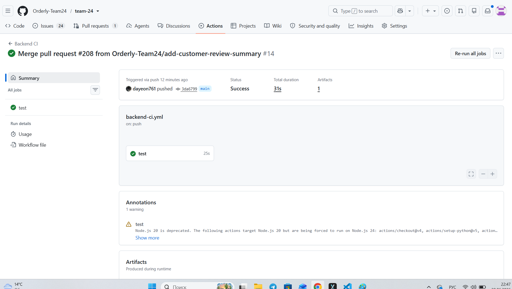
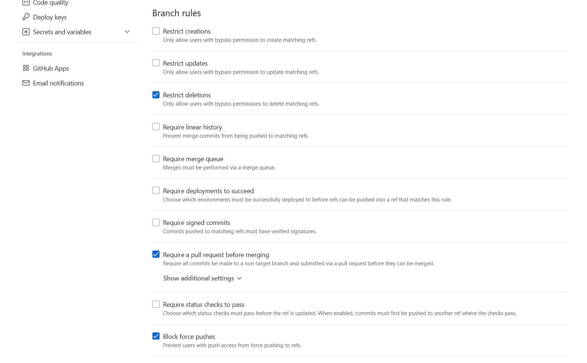
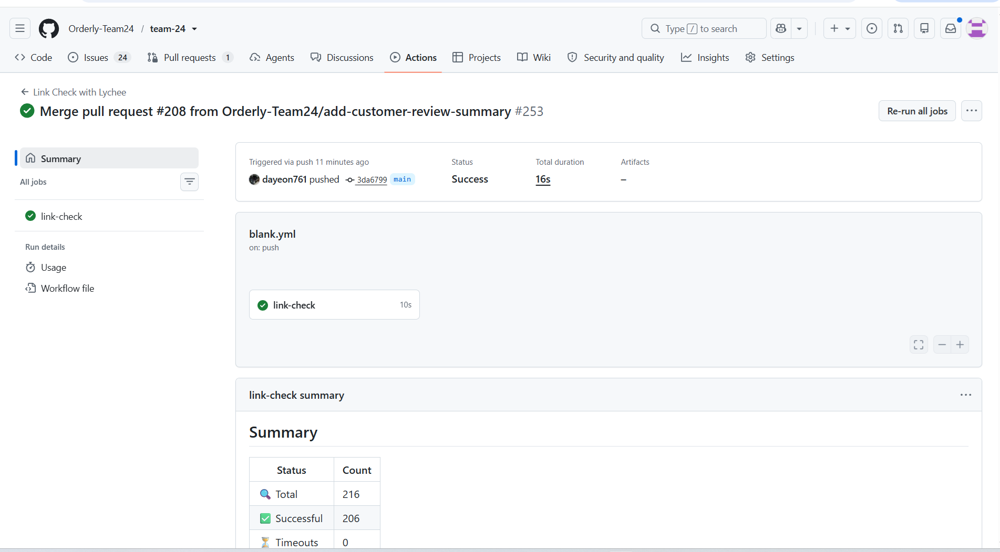
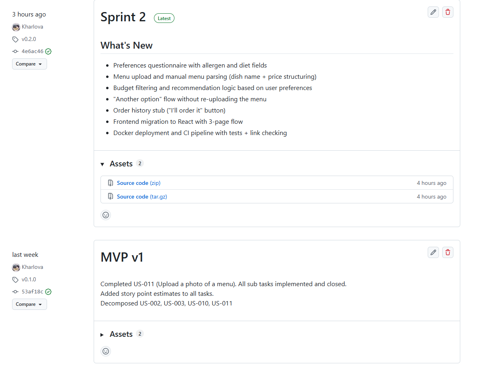
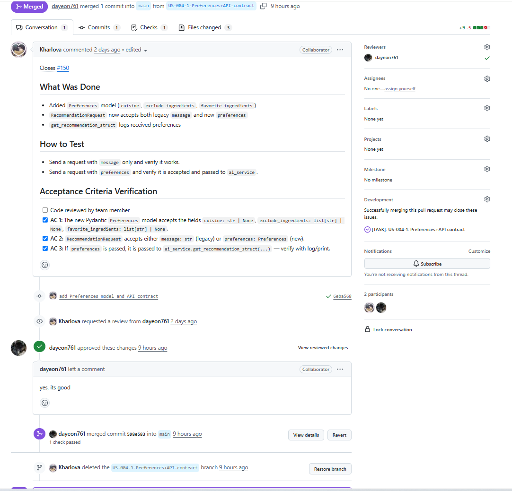

# Week 4 Report – Orderly

## Project information
- **Name:** Orderly – Food Recommendation App
- **Short description:** A web app that helps users choose dishes from restaurant menus based on their preferences and budget.
- **License:** [MIT](../../LICENSE) 

## Product Backlog
- [Product Backlog board/view](https://github.com/orgs/Orderly-Team24/projects/2)
- [Current Sprint Backlog board/view](https://github.com/orgs/Orderly-Team24/projects/3)
- [Current Sprint milestone](https://github.com/Orderly-Team24/team-24/milestone/2)

### Sprint Details
- **Sprint Goal:** End-to-end flow works on the live deployment. Users fill a preferences questionnaire (with mandatory allergens), upload a menu photo, parser structures the menu data, and the recommender returns a dish that matches preferences, contains no allergens, and fits the budget.
- **Sprint Dates:** June 22 2026 – June 27 2026
- **Scope Summary:** Preferences questionnaire (with allergens), menu photo upload, budget filtering, and preference-aware dish recommendation. Public deployment via Docker.
- **Total Sprint Size:** 25 Story Points

## Delivery Summary
- **Delivered Product Changes:** Preferences questionnaire with allergen/diet fields, menu photo upload with OCR text extraction, menu parser (dish name + price structuring), AI recommender filtered by preferences, allergens, and budget, "Another option" flow without re-uploading menu, public deployment via Docker
- **Access/Run instructions:** [README.md](../../README.md)
- **Deployed Product (runnable artifact):** [product](https://team-24-navy.vercel.app/)

## Customer Feedback & Response
| Feedback Point | Resulting PBI / Issue |
| :--- | :--- |
| Preferences are not saved after page refresh; user has to re-enter them each time | new issue — Implement preferences persistence (cookies/localStorage) |
| "Another option" sometimes returns the same dish instead of a different one | new issue — Fix "Another option" to return distinct recommendations |
| Cuisine selection is not helpful, replace with taste-based preferences (sweet, spicy, etc.) | new issue — Replace cuisine selection with taste-based preferences |
| No order history yet | [#149](https://github.com/Orderly-Team24/team-24/issues/149) — US-015: Managing history of orders |

### Feedback Not Addressed
OCR and AI not connected to frontend - deferred to Sprint 3, requires additional development.

## Documentation
- **Roadmap:** [docs/roadmap.md](../../docs/roadmap.md)
- **Definition of Done:** [docs/definition-of-done.md](../../docs/definition-of-done.md)
- **Quality Requirements:** [docs/quality-requirements.md](../../docs/quality-requirements.md)
- **Quality Requirement Tests:** [docs/quality-requirement-tests.md](../../docs/quality-requirement-tests.md)
- **Testing Strategy:** [docs/testing.md](../../docs/testing.md)
- **User Acceptance Tests (UAT):** [docs/user-acceptance-tests.md](../../docs/user-acceptance-tests.md)

## Quality Assurance & Testing
- **Quality Model:** ISO/IEC 25010 - reliability, security, maintainability.
- **Selected Sub-characteristics:** functional correctness, fault tolerance, input validation.
- **Testing Status Summary:**
    - **Critical Modules:** budget_filter.py, order_history.py, parser.py, upload/main.py
    - **Per-module Line Coverage:** >=30 required for each critical module

### Test Links
- **Unit Tests:** test_budget_filter.py, test_history_router.py, test_parser.py, test_preferences.py, test_upload.py, test_parser.py
- **Integration Tests:** test_budget_filter.py, test_history_router.py, test_ai_service.py, test_response_time.py, test_upload.py
- **Automated Quality Requirement Tests:** quality-requirement-tests.md, test_response_time.py

## CI / CD & Branch Protection
- **CI Pipeline Definition:** [.github/workflows/blank.yml](../../.github/workflows/blank.yml)
- **Latest Protected-Branch CI Run:** [CI Run](https://github.com/Orderly-Team24/team-24/actions/runs/28323344180)
- **Branch Protection Rules Evidence:** [Rules](https://github.com/Orderly-Team24/team-24/settings/branches)

## Forward Governance
**How Assignment 4 artifacts will govern future work:**
All future work will be governed by the Assignment 4 artifacts:
- **DoD** — all tasks must meet Definition of Done before closing.
- **CI/CD** — must pass on every PR and push to `main`.
- **Testing** — unit + integration tests required, coverage ≥ 30% for critical modules.
- **Branch Protection** — PR approvals + CI required for merging.

## Release & Changelog
- **SemVer Release:** [SemVer](https://github.com/Orderly-Team24/team-24/releases/tag/v0.2.0)
- **CHANGELOG.md:** [CHANGELOG.md](../../CHANGELOG.md)

## Presentation & Media
- **Demo Video:** [video](https://drive.google.com/file/d/15KcZhWxZc0COzW0FGXIrOBryH1YQ4cq3/view?usp=sharing)
- **Presentation Slides:** [presentation](https://docs.google.com/presentation/d/1SNAzJcnGL-ysbFUlnl2ymxmEgd72nhBRrQzrYioJWyQ/edit?usp=sharing)
- **Customer Review Transcript:** [customer review transcript](customer-review-transcript.md)

## UAT Results Summary
- **UAT-01** (Budget filtering) - Passed
- **UAT-02** (Order confirmation) - Passed
- **UAT-03** (Another option) - Partial (sometimes returns the same dish)

## Sprint Reports & Retrospectives
- **Customer Review Summary:** [customer review summary]([customer-review-summary.md])
- **Sprint Reflection:** [Week 4 Reflection](reflection.md)
- **Retrospective:** [Week 4 Retrospective](retrospective.md)
- **LLM Report:** [LLM Report](llm-report.md)

## Current Status & Next Steps
- **Current Product Status:**
- Questionnaire, budget filtering, default menu recommendations, and UI flow are working.
- OCR + AI are not yet connected to the frontend; preferences do not persist after page refresh.
- **Next Steps:**  Implement preferences persistence (cookies/localStorage) and fix "Another option" to return distinct recommendations. Also connect OCR + AI to the frontend and start order history.

## Contribution Traceability

| Team Member | Issues | PRs/MRs | Review Activity | Testing | Quality/Automation | Documentation |
| :--- | :--- | :--- | :--- | :--- | :--- | :--- |
| Daria Gorshkova (dayeon761) | [#157](https://github.com/Orderly-Team24/team-24/issues/157), [#154](https://github.com/Orderly-Team24/team-24/issues/154), [#146](https://github.com/Orderly-Team24/team-24/issues/146) | [#198](https://github.com/Orderly-Team24/team-24/pull/198), [#196](https://github.com/Orderly-Team24/team-24/pull/196), [#195](https://github.com/Orderly-Team24/team-24/pull/195), [#194](https://github.com/Orderly-Team24/team-24/pull/194), [#192](https://github.com/Orderly-Team24/team-24/pull/192), [#191](https://github.com/Orderly-Team24/team-24/pull/191), [#190](https://github.com/Orderly-Team24/team-24/pull/190), [#186](https://github.com/Orderly-Team24/team-24/pull/186), [#175](https://github.com/Orderly-Team24/team-24/pull/175), [#174](https://github.com/Orderly-Team24/team-24/pull/174), [#173](https://github.com/Orderly-Team24/team-24/pull/173), [#168](https://github.com/Orderly-Team24/team-24/pull/168), [#163](https://github.com/Orderly-Team24/team-24/pull/163) | [#197](https://github.com/Orderly-Team24/team-24/pull/197), [#193](https://github.com/Orderly-Team24/team-24/pull/193), [#185](https://github.com/Orderly-Team24/team-24/pull/185), [#184](https://github.com/Orderly-Team24/team-24/pull/184), [#183](https://github.com/Orderly-Team24/team-24/pull/183), [#180](https://github.com/Orderly-Team24/team-24/pull/180), [#171](https://github.com/Orderly-Team24/team-24/pull/171), [#167](https://github.com/Orderly-Team24/team-24/pull/167) | [docs/testing.md](../../docs/testing.md) | [docs/user-acceptance-tests.md](../../docs/user-acceptance-tests.md), [docs/quality-requirement-tests.md](../../docs/quality-requirement-tests.md) | — |
| Viktoriia Iakovleva (rxxtzz) | [#161](https://github.com/Orderly-Team24/team-24/issues/161), [#152](https://github.com/Orderly-Team24/team-24/issues/152) | [#193](https://github.com/Orderly-Team24/team-24/pull/193), [#187](https://github.com/Orderly-Team24/team-24/pull/187), [#181](https://github.com/Orderly-Team24/team-24/pull/181), [#178](https://github.com/Orderly-Team24/team-24/pull/178), [#172](https://github.com/Orderly-Team24/team-24/pull/172), [#171](https://github.com/Orderly-Team24/team-24/pull/171), [#170](https://github.com/Orderly-Team24/team-24/pull/170) | [#195](https://github.com/Orderly-Team24/team-24/pull/195), [#194](https://github.com/Orderly-Team24/team-24/pull/194), [#192](https://github.com/Orderly-Team24/team-24/pull/192), [#191](https://github.com/Orderly-Team24/team-24/pull/191), [#190](https://github.com/Orderly-Team24/team-24/pull/190), [#189](https://github.com/Orderly-Team24/team-24/pull/189), [#188](https://github.com/Orderly-Team24/team-24/pull/188), [#186](https://github.com/Orderly-Team24/team-24/pull/186), [#175](https://github.com/Orderly-Team24/team-24/pull/175), [#174](https://github.com/Orderly-Team24/team-24/pull/174), [#173](https://github.com/Orderly-Team24/team-24/pull/173) | — | — | [reports/week4/reflection.md](../../reports/week4/reflection.md) |
| Polina Kharlova (Kharlova) | [#159](https://github.com/Orderly-Team24/team-24/issues/159), [#150](https://github.com/Orderly-Team24/team-24/issues/150) | [#180](https://github.com/Orderly-Team24/team-24/pull/180), [#167](https://github.com/Orderly-Team24/team-24/pull/167) | [#198](https://github.com/Orderly-Team24/team-24/pull/198), [#168](https://github.com/Orderly-Team24/team-24/pull/168), [#164](https://github.com/Orderly-Team24/team-24/pull/164), [#163](https://github.com/Orderly-Team24/team-24/pull/163) | — | — | [reports/week4/README.md](../../reports/week4/README.md) |
| Vilena Zulkarnaeva (vianevi) | [#161](https://github.com/Orderly-Team24/team-24/issues/161), [#155](https://github.com/Orderly-Team24/team-24/issues/155), [#146](https://github.com/Orderly-Team24/team-24/issues/146) | [#197](https://github.com/Orderly-Team24/team-24/pull/197), [#189](https://github.com/Orderly-Team24/team-24/pull/189), [#188](https://github.com/Orderly-Team24/team-24/pull/188), [#184](https://github.com/Orderly-Team24/team-24/pull/184), [#183](https://github.com/Orderly-Team24/team-24/pull/183) | [#200](https://github.com/Orderly-Team24/team-24/pull/200), [#199](https://github.com/Orderly-Team24/team-24/pull/199), [#196](https://github.com/Orderly-Team24/team-24/pull/196), [#187](https://github.com/Orderly-Team24/team-24/pull/187), [#186](https://github.com/Orderly-Team24/team-24/pull/186), [#181](https://github.com/Orderly-Team24/team-24/pull/181), [#178](https://github.com/Orderly-Team24/team-24/pull/178), [#172](https://github.com/Orderly-Team24/team-24/pull/172), [#170](https://github.com/Orderly-Team24/team-24/pull/170) | — | — | [docs/roadmap.md](../../docs/roadmap.md), [reports/week4/retrospective.md](../../reports/week4/retrospective.md), [reports/week4/customer-review-transcript.md](../../reports/week4/customer-review-transcript.md), [reports/week4/customer-review-summary.md](../../reports/week4/customer-review-summary.md) |
| Omar Nader (Ramy678) | [#151](https://github.com/Orderly-Team24/team-24/issues/151) | [#177](https://github.com/Orderly-Team24/team-24/pull/177) | [#176](https://github.com/Orderly-Team24/team-24/pull/176) | — | — | [reports/week4/customer-review-summary.md](../../reports/week4/customer-review-summary.md) |
| Adelina Khafizova (adelinamikki) | [#153](https://github.com/Orderly-Team24/team-24/issues/153) | [#185](https://github.com/Orderly-Team24/team-24/pull/185), [#176](https://github.com/Orderly-Team24/team-24/pull/176), [#164](https://github.com/Orderly-Team24/team-24/pull/164) | [#177](https://github.com/Orderly-Team24/team-24/pull/177) | — | [docs/definition-of-done.md](../../docs/definition-of-done.md) | [reports/week4/images/](../../reports/week4/images/), [reports/week4/llm-report.md](../../reports/week4/llm-report.md) |

## Visual Evidence (Screenshots)
### Sprint Milestone

### Latest Protected-Branch CI Run

### Branch Protection / Rules Evidence

### Coverage / Test Report

### SemVer Release

### Example Reviewed Issue-linked PR/MR

